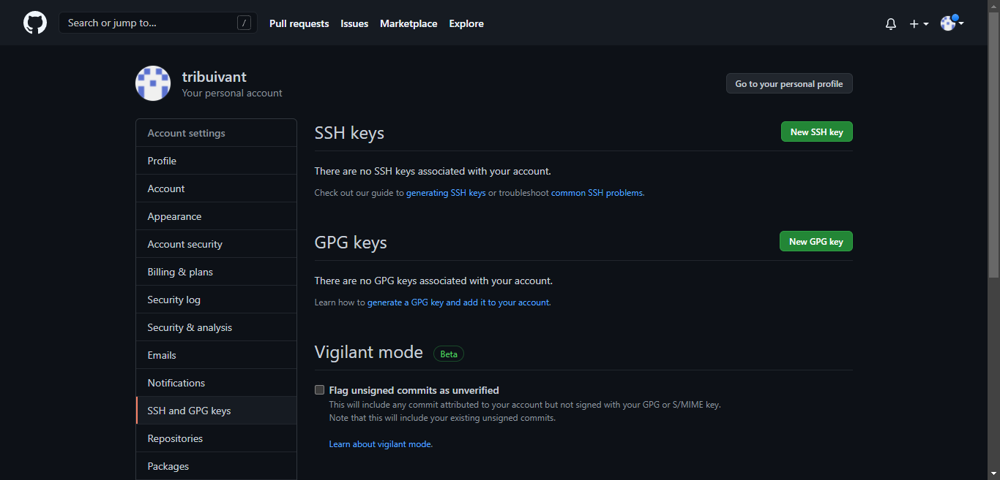
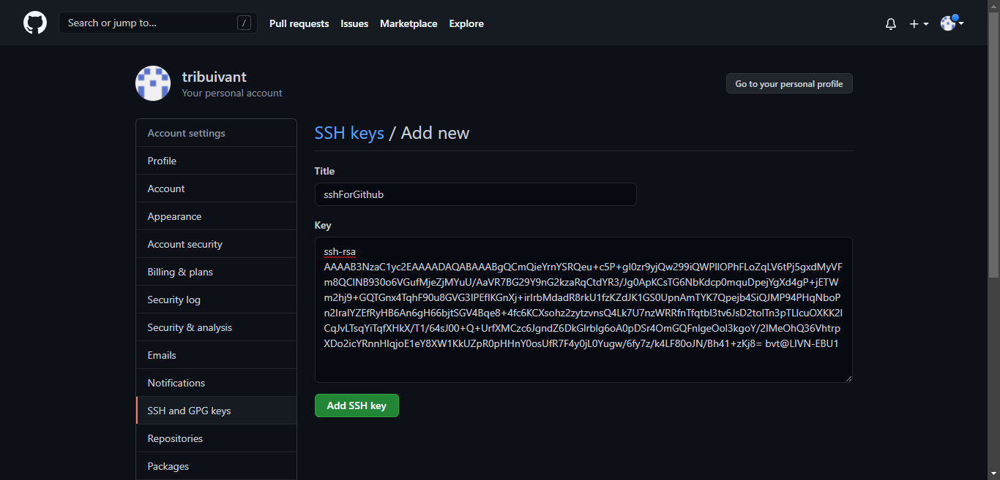

## Tạo SSH key

```
mkdir sshforgithub
ssh-keygen -t rsa -f id_rsa
ls -la sshforgithub
```

## Thêm SSH key vào trong Github

Truy cập https://github.com/settings/keys



Thêm public key vào trong Github


Nhập mật khẩu của Github để xác thực.


## Thiết lập SSH trên máy tính

Di chuyển key vào trong thư mục SSH, cụ thể là `.ssh`
```
mv id_rsa ~/.ssh
```

Thêm dòng sau vào ~/.ssh/config
```
# My Github
Host github.com
        User git
        Hostname github.com
        Port 22
        PreferredAuthentications publickey
        IdentityFile    ~/.ssh/id_rsa
```

Thêm repo remote vào trong project
```
git remote -v
git remote add github git@github.com:tribuivant/tribuivant.github.io.git
git push github master
```