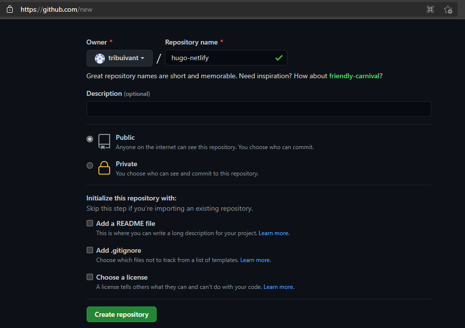
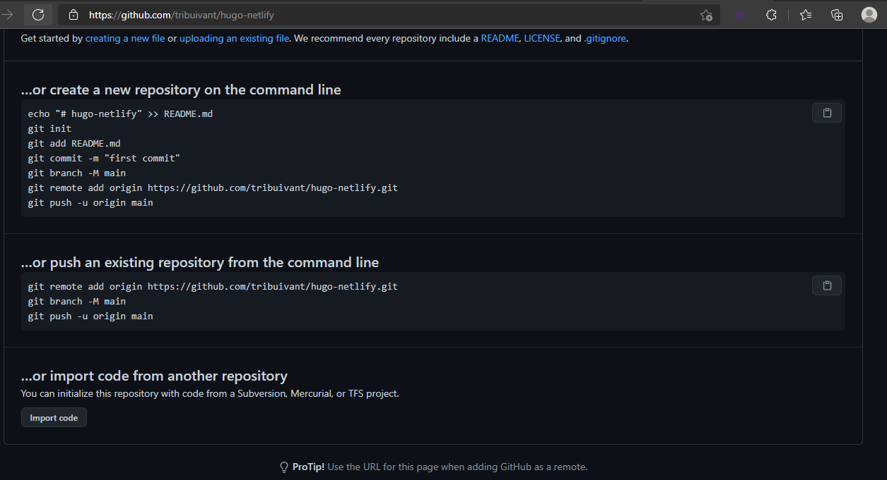
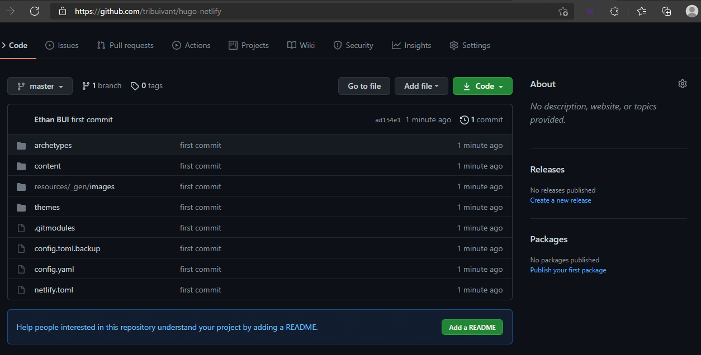
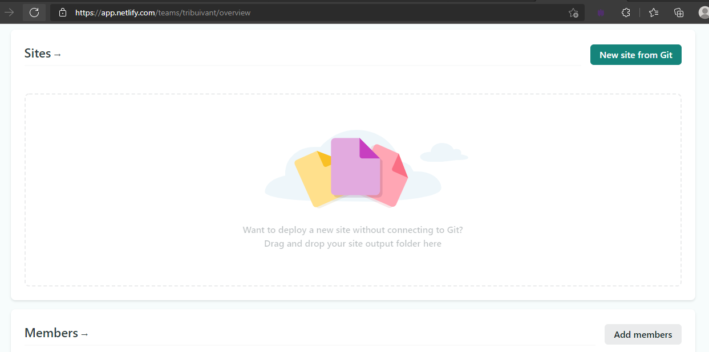
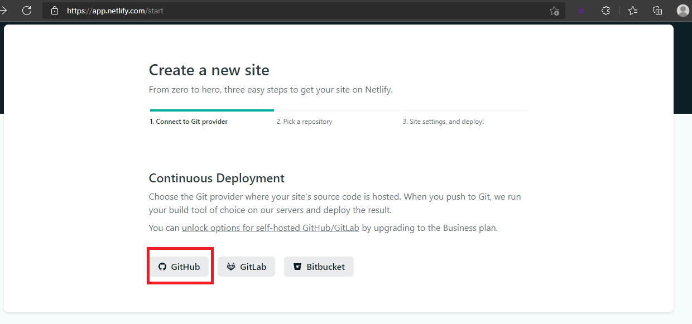
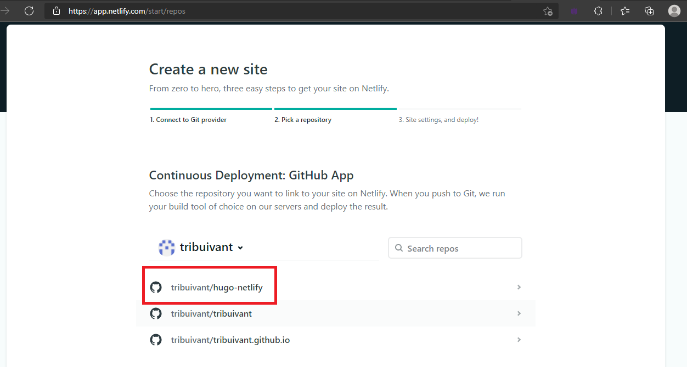
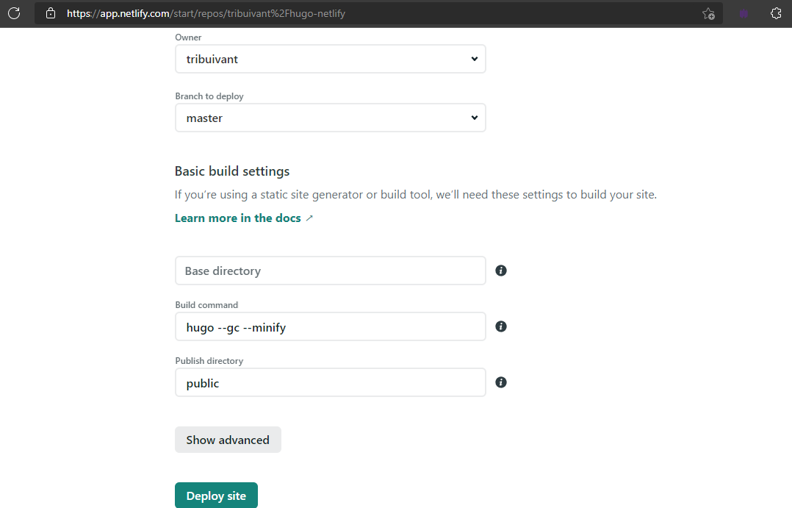
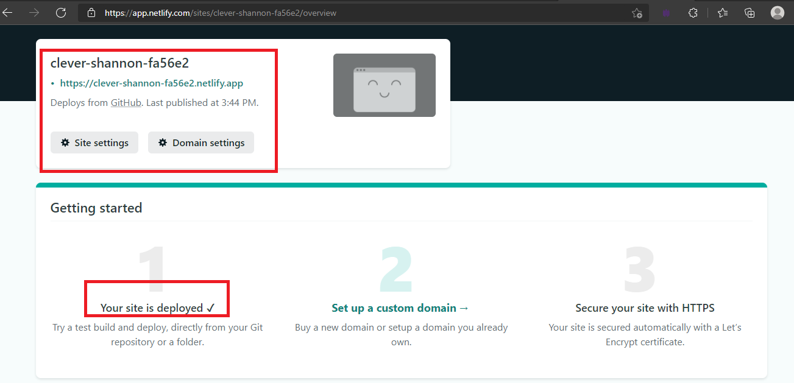

## Giới thiệu
### Hugo là gì?

Hugo (framework) là một framework được xây dựng dựa trên Golang. Trang chủ https://gohugo.io

### Netlify

Netlify là một nền tảng Cloud computing (Điện toán đám mây) dùng để lưu trữ (hosting) và chạy Serverless back-end cho ứng dụng Web và cho các website tĩnh. Trang chủ https://www.netlify.com

## Cài đặt

Đây là trang chủ hướng dẫn cài đặt của Hugo, khá chi tiết (https://gohugo.io/getting-started/installing).

> Hugo có 2 loại:
> - Không mở rộng Sass/SCSS (non-extended)
> - Mở rộng Sass/SCSS (extended)
>
> Vậy khi nào cần dùng phần mở rộng Sass/SCSS. Câu trả lời là tuỳ vào themes bạn sử dụng.

> Trong bài này, mình cài đặt Hugo trên Ubuntu 20.04 và sử dụng themes cần mở rộng nên sẽ có cách lệnh như sau:

```
sudo apt-get install hugo
dkpg -i hugo_0.86.1_Linux-64bit.deb
dkpg -i hugo_extended_0.86.1_Linux-64bit.deb
```

Bạn có thể tải các package đã được release [ở đây](https://github.com/gohugoio/hugo/releases)


Kiểm tra version của Hugo
```
hugo version
```

Bắt đầu một website mới bằng lệnh
```
hugo new site <site-name>
```

Chúng ta sẽ sử dụng Git để lưu trữ mã nguồn. Vào thư mục ```<site-name>```
```
git init
```

### Thêm themes trên Hugo

Trang chủ để chúng ta lựa chọn themes https://themes.gohugo.io. Sau khi chọn được themes thích hợp, chúng ta sẽ thêm themes này vào trong Hugo.
```git
git submodule add https://github.com/jakewies/hugo-theme-codex.git themes/hugo-theme-codex
```

Cấu hình cho website để chạy.
> Mỗi themes sẽ có cấu hình riêng nên chúng ta sử dụng lệnh sau để chép cấu hình sang Hugo.
```
cp themes/hugo-theme-codex/exampleSite/config.toml config.toml
```

Xoá `themesDir = "../../"` trong `config.toml`.

Khởi chạy website dưới local. Truy cập http://localhost:1313
```
hugo server -D
```

### Triển khai Hugo lên Netlify

Tạo một file mới tên là `netlify.toml`
```toml
[build]
publish = "public"
command = "hugo --gc --minify"

[context.production.environment]
HUGO_VERSION = "0.86.1"
HUGO_ENV = "production"
HUGO_ENABLEGITINFO = "true"

[context.split1]
command = "hugo --gc --minify --enableGitInfo"

[context.split1.environment]
HUGO_VERSION = "0.86.1"
HUGO_ENV = "production"

[context.deploy-preview]
command = "hugo --gc --minify --buildFuture -b $DEPLOY_PRIME_URL"

[context.deploy-preview.environment]
HUGO_VERSION = "0.86.1"

[context.branch-deploy]
command = "hugo --gc --minify -b $DEPLOY_PRIME_URL"

[context.branch-deploy.environment]
HUGO_VERSION = "0.86.1"

[context.next.environment]
HUGO_ENABLEGITINFO = "true"
```

Trên Github, chúng ta sẽ tạo mới một repo. Truy cập https://github.com/new



Sử dụng các lệnh để thêm mã nguồn vào repo


```
git add .
git commit -m "first commit"
git remote add origin https://github.com/tribuivant/hugo-netlify.git
git push origin master
```

Sau khi cấu hình xong, chúng ta sẽ thấy mã nguồn trên Github repo


### Triển khai Hugo lên Netlify

Sau khi tạo tài khoản trên Netlify. Chúng ta tạo một site mới.


Để lấy được mã nguồn, thì chúng ta phải thông qua Github. Bước tiếp theo là chứng thực cho Netlify để pull mã nguồn từ Github về.
>Nếu tab hiện ra thông báo ```Authorized``` thì đã chứng thực thành công.


Chọn repo chứa mã nguồn.


Bước tiếp theo chỉ cần Deploy nữa là xong.


Khi chúng ta nhận được thông báo như vầy thì ta đã có một trang web.


Tuy nhiên, ở ví dụ này Netlify tự sinh ra domain. Chúng ta có thể sửa lại domain này bên trong `Site settings` .

Trang demo: https://buivantri-hugo.netlify.app

## Một số lỗi thường gặp khi cài đặt và triển khai.

1. Lỗi trong phần Hugo
   - Cài đặt Hugo lỗi
   - Thiếu phần mở rộng Sass/SCSS trên Hugo.
   - Sai `config.toml` trong `themes`
2. Lỗi trong phần triển khai lên Netlify
   - Sai `netlify.toml` dẫn đến deploy lỗi.

## Tham khảo
https://docs.netlify.com/configure-builds/common-configurations/hugo/

https://gohugo.io/hosting-and-deployment/hosting-on-netlify/