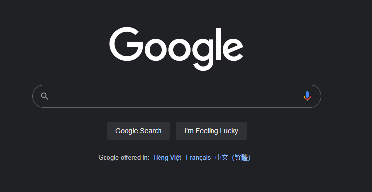

## Giới thiệu Google
Google là một công ty công nghệ của Mỹ, chuyên cung cấp các dịch vụ trên Internet như công cụ tìm kiếm, quảng cáo trực tuyến, điện toán đám mây,...

## Cách sử dụng Google
Rất đơn giản. Nhưng trước tiên, bạn phải có một **trình duyệt** trên các nền tảng máy tính, điện thoại. Ví dụ như Google Chrome, Cốc cốc, Firefox,...

Tiếp theo, bạn truy cập theo địa chỉ https://www.google.com

## Các mẹo để tận dụng tối đa trên Google

1. Google là một cỗ máy thông minh.

    Bạn có thể diễn đạt bằng từ ngữ thông thường và đặt ra câu hỏi cho Google. Google sẽ trả lời cho bạn.

1. Sử dụng dấu ngoặc kép

    Bạn có thể sử dụng dấu ngoặc kép

2. Sử dụng dấu sao (*)
   
    Bạn có thể sử dụng dấu *

3. Sử dụng site: để tìm chính xác trang bạn cần

    Bạn có thể sử dụng site:

## Một số trang tìm kiếm tương tự
Một số trang tìm kiếm tương tự như
- Cốc cốc
- Bing
- Duckduckgo

## Tham khảo
[Google trên Wikipedia](https://vi.wikipedia.org/wiki/Google)
