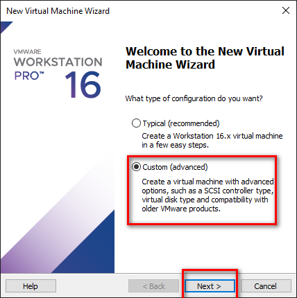

## Giới thiệu

## Cần chuẩn bị
1. Máy ảo (trong bài này mình sử dụng VMware 16)
2. File ISO CentOS 7.6

## Cài đặt môi trường

### Cài đặt máy ảo




Chọn `DATE & TIME`.


### Cấu hình cho máy ảo


```
vi /etc/yum.conf
exclude=centos-release*
```


### Cài đặt Webserver

> Yêu cầu: Apache phiên bản 2.4

Ở bài viết này, chúng ta sẽ sử dụng Apache làm Webserver. Cài đặt Apache trên CentOS 7.6
```bash
yum install httpd
```

Kiểm tra version của Apache
```
httpd -V
```


Kiểm tra tình trạng và khởi động Apache
```
systemctl status httpd
systemctl enable --now httpd
systemctl start httpd
```

Mở port cho Apache
```
firewall-cmd --add-service=http --permanent
firewall-cmd --add-service=https --permanent
firewall-cmd --reload
```


### Cài đặt ngôn ngữ lập trình

> Yêu cầu: PHP phiên bản 7.4

https://www.server-world.info/en/note?os=CentOS_7&p=initial_conf&f=6

```
sed -i -e "s/\]$/\]\npriority=10/g" /etc/yum.repos.d/CentOS-Base.repo

yum -y install http://rpms.famillecollet.com/enterprise/remi-release-7.rpm

```

```
sudo yum -y install yum-utils
sudo yum-config-manager --enable remi-php74

yum install https://dl.fedoraproject.org/pub/epel/epel-release-latest-7.noarch.rpm -y

yum install http://rpms.remirepo.net/enterprise/remi-release-7.rpm -y

yum --enablerepo=remi-php74 install php -y
yum --enablerepo=remi-php74 install php-cli php-xml php-soap php-xmlrpc php-mbstring php-json php-gd php-mcrypt

php -v
php --modules

sudo vi /var/www/html/info.php
<?php phpinfo(); ?>

yum --enablerepo=remi-php74 install php-fpm php-gd php-pdo php-mbstring php-pear -y

sudo rm /var/www/html/info.php

systemctl restart httpd
```

### Cài đặt Database

> Yêu cầu: MySQL phiên bản 5.6

https://www.server-world.info/en/note?os=CentOS_7&p=mysql56&f=1

```
yum install wget

wget http://repo.mysql.com/mysql-community-release-el7-5.noarch.rpm

rpm -ivh mysql-community-release-el7-5.noarch.rpm

ls -1 /etc/yum.repos.d/mysql-community*

yum install mysql-server

systemctl start mysqld

systemctl status mysqld

mysql_secure_installation

Set root password and Yes to all

mysql -V

mysql -u root -p

firewall-cmd --add-service=mysqld --permanent
firewall-cmd --reload
```

```
select user,host,password from mysql.user;
show databases;
```

## Cài đặt WordPress

```
CREATE DATABASE wordpress;

CREATE USER adminuser@localhost IDENTIFIED BY 'TriBUI@2021';

GRANT ALL PRIVILEGES ON wordpress.* TO adminuser@localhost IDENTIFIED BY 'TriBUI@2021';

FLUSH PRIVILEGES;

exit
```

```
cd ~
wget http://wordpress.org/latest.tar.gz

tar -xzvf latest.tar.gz

cp -r ~/wordpress/ /var/www/html/

sudo chown -R apache:apache /var/www/html/*
```

```
cd /var/www/html

cp wp-config-sample.php wp-config.php

vi wp-config.php
```

```php
// ** MySQL settings - You can get this info from your web host ** //
/** The name of the database for WordPress */
define( 'DB_NAME', 'wordpress' );

/** MySQL database username */
define( 'DB_USER', 'adminuser' );

/** MySQL database password */
define( 'DB_PASSWORD', 'TriBUI@2021' );

/** MySQL hostname */
define( 'DB_HOST', 'localhost' );
```


```
yum --enablerepo=remi-php74 install php-mysql

```

```
systemctl restart httpd
systemctl restart mysqld
```


## Cấu hình ra bên ngoài sử dụng ngrok

Đăng ký tài khoản ngrok [ở đây](https://dashboard.ngrok.com/signup)

```
cd ~

wget https://bin.equinox.io/c/4VmDzA7iaHb/ngrok-stable-linux-amd64.zip

yum install unzip

./ngrok authtoken 1w7yOSVfSYC3zxxxxx

./ngrok http 80
```

```
yum install tmux
tmux new -s ngrok
```

```php
define( 'WP_HOME', 'http://192.168.3.136' );
define( 'WP_SITEURL', 'http://192.168.3.136' );
```

## Một số lỗi thường gặp và chú ý

- Chú ý yêu cầu của WordPress, tham khảo ở đây https://wordpress.org/download/

## Tham khảo

https://www.server-world.info/en/note?os=CentOS_7&p=httpd&f=1

https://www.digitalocean.com/community/tutorials/how-to-install-wordpress-on-centos-7

https://www.digitalocean.com/community/tutorials/how-to-install-linux-apache-mysql-php-lamp-stack-on-centos-7